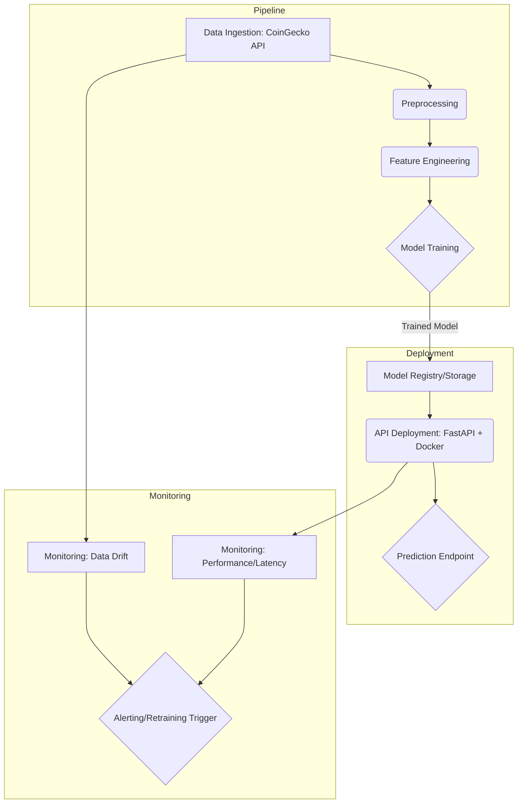

# Technical Report: Cryptocurrency Price Prediction MLOps Pipeline

## 1. Introduction and Project Aim

*(Describe the project, its goals, the problem being solved - e.g., predicting short-term crypto price movements, and the overall objective of the MLOps pipeline.)*

## 2. Pipeline Diagram

*(Insert a visual diagram of the MLOps pipeline here. This could be created using tools like diagrams.net (draw.io), Lucidchart, or even ASCII art.)*

*(This is a basic Mermaid diagram example. You'll need to refine it.)*

## 3. Technical Details

### 3.1 Data Ingestion

*(Explain how data is sourced from the CoinGecko API. Detail the specific endpoints used, data frequency, handling of historical vs. real-time data (simulation), storage format, etc.)*

### 3.2 Preprocessing

*(Describe the cleaning steps: handling missing values, normalization/scaling, data type conversions, outlier detection/handling, etc.)*

### 3.3 Feature Engineering

*(Detail the features created: e.g., lagged prices, moving averages, volatility measures, RSI, MACD, time-based features. Explain the rationale for feature selection.)*

### 3.4 Model Training

*(Specify the chosen model algorithm (e.g., Logistic Regression, RandomForest, Gradient Boosting, LSTM). Explain the training process, evaluation metric (e.g., accuracy, precision, recall, F1-score, AUC), cross-validation strategy, and hyperparameter tuning approach.)*

### 3.5 Deployment

*(Describe the deployment strategy: Containerization using Docker, deployment environment (e.g., local, cloud VM, Kubernetes, Serverless), API framework (FastAPI), and how the model artifact is loaded and served.)*

### 3.6 Monitoring

*(Outline the monitoring plan: Key metrics tracked (model accuracy drift, prediction latency, resource usage, data distribution drift), tools used (e.g., logging, Prometheus/Grafana placeholders, MLflow), alerting mechanisms, and triggers for retraining.)*

## 4. Evaluation and Monitoring Strategy

*(Provide a more detailed plan for ongoing evaluation. How often is the model re-evaluated? What are the thresholds for retraining? How is data drift quantified? How are concept drift issues addressed?)*

## 5. Frontend Solution Image (If Applicable)

*(Insert a screenshot or link to any frontend component, like a Streamlit dashboard or a simple web page interacting with the API.)*

## 6. GitHub Repository Link

*(Provide the link to the public GitHub repository containing the project code.)*
